# Capitex

## Temat projektu

Tematem projektu jest aplikacja webowa Capitex, która umożliwia śledzenie własnych inwestycji, gdzie transakcja ich została dokonana na wielu platformach/portfelach np. XTB, Binance itd. Użytkownik rejestruje konto, tworzy portfele (broker, giełda, alternatywy), dodaje transakcje kupna i obserwuje wartość portfela, niezrealizowany zysk/stratę oraz wykresy. Administrator zarządza kontami użytkowników w systemie. Aplikacja rozwiązuje problem braku jednego miejsca monitorowania naszych inwestycji. Istnieją już podobne rozwiązania takie jak chociażby aplikacja getquin natomiast nasza aplikacja w swojej pierwszej wersji wyróżnia się minimalizmem i łatwym zarządzaniem użytkownikami po stronie administratora, gdzie ten ma swój własny panel wraz z możliwością monitorowania własnych inwestycji.

## Uruchomienie projektu (developer)

Kod aplikacji znajduje się w katalogu `capitex/` (w repozytorium `aplikacje-internetowe`).

## Użyte technologie

| Komponent | Technologia | Wersja | Zastosowanie | Link |
| :--- | :--- | :--- | :--- | :--- |
| Backend | PHP | 8.3+ (testowane: **8.5.3**) | Logika serwera, API wewnętrzne | [php.net](https://www.php.net/) |
| Framework | Laravel | **13.11.1** (^13.8) | MVC, routing, ORM, migracje | [laravel.com](https://laravel.com/) |
| Autentykacja | Laravel Breeze | ^2.4 | Logowanie, rejestracja, sesje | [laravel.com/docs/starter-kits](https://laravel.com/docs/starter-kits) |
| Baza danych | SQLite | 3.x | Plik `database/database.sqlite` | [sqlite.org](https://www.sqlite.org/) |
| Menedżer PHP | Composer | 2.x (np. **2.9.x**) | Zależności PHP (`composer install`) | [getcomposer.org](https://getcomposer.org/) |
| Runtime JS | Node.js | 22+ (zalecane) | Build frontendu (Vite) | [nodejs.org](https://nodejs.org/) |
| Menedżer JS | npm | 10+ | Pakiety JavaScript (`npm install`) | [npmjs.com](https://www.npmjs.com/) |
| Bundler | Vite | ^8.0 | Kompilacja CSS/JS (`npm run build`) | [vitejs.dev](https://vitejs.dev/) |
| CSS / UI | Bootstrap | ^5.3.8 | Layout, komponenty, modale | [getbootstrap.com](https://getbootstrap.com/) |
| Ikony | Bootstrap Icons | 1.11.3 | Ikony w panelu użytkownika i admina | [icons.getbootstrap.com](https://icons.getbootstrap.com/) |
| Wykresy | Chart.js | CDN (jsdelivr) | Wykres liniowy i donut na dashboardzie | [chartjs.org](https://www.chartjs.org/) |
| Zapytania AJAX | Fetch API (natywny JS) | — | Autocomplete aktywów, ceny, kursy NBP w dashboardzie | [MDN: fetch](https://developer.mozilla.org/pl/docs/Web/API/Fetch_API) |

**API zewnętrzne (bez konfiguracji w `.env`):**
- Binance – ceny kryptowalut
- Yahoo Finance – ceny akcji/ETF, wyszukiwanie tickerów
- NBP – kursy walut (tabela A)

### Wymagania programowe

#### System operacyjny
- Projekt rozwijany i testowany na **Microsoft Windows 11 Pro** (działa też na Linux/macOS).

#### Środowisko uruchomieniowe
- **PHP 8.3+** z rozszerzeniami: `pdo_sqlite`, `mbstring`, `openssl`, `fileinfo` (avatary), zalecane `curl` (zapytania do API).
- **Composer 2.x**
- **Node.js 22+** i **npm**
- **Git** (klonowanie repozytorium)

#### Baza danych
- **SQLite** – nie wymaga osobnego serwera (MySQL/PostgreSQL opcjonalnie po zmianie `DB_*` w `.env`).

#### Dodatkowe narzędzia 
- Przeglądarka (Chrome, Firefox, Edge)
- Połączenie z internetem (pobieranie cen z API)
- Edytor kodu 


### Proces instalacji

Poniższa instrukcja zakłada, że osoba uruchamiająca projekt **nie zna Laravela**. Wszystkie komendy wykonuj w katalogu `capitex/` (cd capitex/).

#### Krok 1: Pobranie projektu

1. Otwórz terminal (PowerShell, CMD lub terminal w VS Code).
2. Przejdź do folderu, w którym ma znaleźć się projekt.
3. Sklonuj repozytorium:

```bash
git clone <URL_TWOJEGO_REPOZYTORIUM>
cd aplikacje-internetowe/capitex
```

Lub poprzez aplikację **GitHub Desktop**, gdzie proces jest zautomatyzowany

> Zamień `<URL_TWOJEGO_REPOZYTORIUM>` na link do repozytorium Git (GitHub / GitLab).

#### Krok 2: Instalacja zależności PHP

Laravel i biblioteki PHP instalujesz przez Composer:

```bash
composer install
```

Komenda pobiera pakiety z pliku `composer.json` do folderu `vendor/`.

#### Krok 3: Instalacja zależności frontendu

Style i skrypty (Bootstrap, Vite) buduj przez npm:

```bash
npm install
```

Komenda pobiera pakiety z pliku `package.json` do folderu `node_modules/`.

**Alternatywa – jednorazowy setup** (wykonuje kroki 2–3 oraz część konfiguracji):

```bash
composer run setup
```


### Proces konfiguracji

Przed pierwszym uruchomieniem aplikacji wykonaj poniższe kroki (nadal w katalogu `capitex/`).

#### 1. Zmienne środowiskowe

Skopiuj przykładowy plik konfiguracyjny i wygeneruj klucz aplikacji:

```bash
# Windows (CMD / PowerShell)
copy .env.example .env

php artisan key:generate
```

Na Linux/macOS zamiast `copy` użyj: `cp .env.example .env`

Najważniejsze ustawienia w pliku `.env`:

| Zmienna | Opis | Przykładowa wartość |
|---------|------|---------------------|
| `APP_URL` | Adres, pod którym otwierasz aplikację w przeglądarce | `http://127.0.0.1:8000` |
| `APP_DEBUG` | Tryb deweloperski (szczegółowe błędy) | `true` |
| `DB_CONNECTION` | Typ bazy danych | `sqlite` |

> **Uwaga:** Capitex **nie wymaga kluczy API** w `.env`. Integracje z Binance, Yahoo Finance i NBP korzystają z publicznych endpointów – nie trzeba nic wpisywać do pliku `.env` poza standardową konfiguracją Laravela.

#### 2. Baza danych

Projekt domyślnie używa **SQLite** (jeden plik zamiast serwera MySQL).

1. Upewnij się, że w `.env` jest:

```env
DB_CONNECTION=sqlite
```

2. Utwórz pusty plik bazy (jeśli nie istnieje):

```bash
# Windows
type nul > database\database.sqlite

# Linux / macOS
touch database/database.sqlite
```

To jest całe „połączenie z bazą” – Laravel zapisuje dane w pliku `database/database.sqlite`.

#### 3. Migracje

Migracje tworzą strukturę tabel w bazie (użytkownicy, portfele, transakcje itd.):

```bash
php artisan migrate
```

#### 4. Dane początkowe (seed)

Główny seeder (`DatabaseSeeder`) wypełnia bazę danymi startowymi:

| Co tworzy | Plik | Opis |
|-----------|------|------|
| Role `admin` / `user` | `DatabaseSeeder` | Słownik ról w systemie |
| Konto administratora | `DatabaseSeeder` | Jedno konto z pełnymi uprawnieniami |
| **100 kont testowych** | `UserSeeder` | Polskie imiona, nazwiska lub nicki (bez tytułów naukowych), unikalne maile (Faker `pl_PL`), **bez portfeli i transakcji** |
| Słownik aktywów | `AssetSeeder` | Globalne tickery (BTC, AAPL, CDR) – nie przypisane do użytkowników |

**Pełny reset bazy + seed** (zalecane przy pierwszym uruchomieniu i przed zdjęciami do dokumentacji):

```bash
php artisan migrate:fresh --seed
```

Tylko seed na istniejącej strukturze tabel (bez kasowania danych):

```bash
php artisan db:seed
```

> **Uwaga:** `UserSeeder` generuje **nowe** maile przy każdym uruchomieniu. Ponowne `db:seed` bez `migrate:fresh` może skończyć się błędem duplikatów – wtedy użyj `migrate:fresh --seed` albo uruchom tylko brakujące seedery na czystej bazie.

Tylko 100 użytkowników testowych (gdy role i admin już istnieją w bazie):

```bash
php artisan db:seed --class=UserSeeder
```

Dodatkowo utwórz symlink do folderu z plikami publicznymi (wymagany do **avatarów** użytkowników):

```bash
php artisan storage:link
```

**Konto administratora po seedzie:**

| Pole | Wartość |
|------|---------|
| Email | `admin@capitex.pl` |
| Hasło | `admin` |

**Konta testowe z `UserSeeder` (100 szt.):**

| Pole | Wartość |
|------|---------|
| Rola | `user` (zwykły użytkownik) |
| Nazwa / email | Losowe: np. `Anna Kowalska`, `Janek`, `ania42` + mail z Faker |
| Hasło | `password` (wspólne dla wszystkich kont testowych) |
| Portfele / transakcje | Brak – puste konta pod listę w panelu admina i statystyki |

Zwykły użytkownik może też założyć konto samodzielnie przez stronę rejestracji (`/register`) – otrzymuje rolę `user`.

#### 5. Build frontendu

Jeśli nie używałeś `composer run setup`, zbuduj style i skrypty przed uruchomieniem:

```bash
npm run build
```


### Uruchomienie projektu w terminalu

**Wariant podstawowy (wystarczający do testów i obrony):**

```bash
php artisan serve
```

Aplikacja będzie dostępna w przeglądarce pod adresem:

**http://127.0.0.1:8000**

Przydatne adresy po uruchomieniu:

| Strona | Adres |
|--------|-------|
| Strona startowa | http://127.0.0.1:8000/ |
| Logowanie | http://127.0.0.1:8000/login |
| Rejestracja | http://127.0.0.1:8000/register |
| Dashboard (po zalogowaniu) | http://127.0.0.1:8000/dashboard |
| Panel administratora | http://127.0.0.1:8000/admin/dashboard |

**Wariant deweloperski** (serwer PHP + podgląd na żywo zmian CSS/JS):

```bash
composer run dev
```

(lub w dwóch terminalach osobno: `php artisan serve` oraz `npm run dev`)

> Ustaw `APP_URL` w `.env` zgodnie z adresem, pod którym faktycznie otwierasz aplikację (np. `http://127.0.0.1:8000`), szczególnie jeśli używasz avatarów.

## Uruchomienie projektu (user)

Capitex to **aplikacja webowa** – nie wymaga instalacji pliku `.exe` ani `.apk`. Wystarczy nowoczesna przeglądarka i dostęp do internetu.

### Dostęp do aplikacji

W pierwszej wersji projektu aplikacja **nie jest jeszcze opublikowana** w publicznej sieci (brak stałego adresu produkcyjnego). Do testów i demonstracji używa się wersji uruchomionej lokalnie przez programistę (`php artisan serve` → `http://127.0.0.1:8000`).

> Po wdrożeniu na serwer (np. hosting PHP, VPS, Laravel Forge) w tym miejscu należy podać **publiczny link**, np. `https://capitex.example.com`.

### Jak korzystać z aplikacji (bez instalacji)

1. Otwórz w przeglądarce adres aplikacji (lokalny lub publiczny).
2. Załóż konto przez **Rejestrację** lub zaloguj się na istniejące konto.
3. Po zalogowaniu przejdź do **Dashboardu**, aby zarządzać portfelami i transakcjami.

Konto testowe administratora (tylko środowisko deweloperskie po `php artisan db:seed`):

| Pole | Wartość |
|------|---------|
| Email | `admin@capitex.pl` |
| Hasło | `admin` |

### Wymagania sprzętowe

Aplikacja działa w przeglądarce – obciążenie po stronie użytkownika jest niewielkie. Płynne korzystanie zapewni:

| Element | Zalecenie |
|---------|-----------|
| Urządzenie | Komputer, laptop, tablet lub smartfon |
| Procesor | Dowolny współczesny (np. Intel Core i3 / AMD Ryzen 3 lub nowszy) |
| Pamięć RAM | min. **4 GB** (zalecane 8 GB przy wielu kartach w przeglądarce) |
| Połączenie sieciowe | Stabilne łącze internetowe (pobieranie aktualnych cen z API zewnętrznych) |
| Przeglądarka | Aktualna wersja **Chrome**, **Firefox**, **Edge** lub **Safari** |
| Rozdzielczość | min. **360×640 px** (interfejs jest responsywny); wygodniej od **1280×720 px** na desktopie |

Na słabszym sprzęcie lub wolniejszym internecie aplikacja nadal działa, ale ładowanie cen aktywów i wykresów na dashboardzie może trwać nieco dłużej.

## Podręcznik użytkownika

Poniższy opis dotyczy korzystania z aplikacji z perspektywy użytkownika końcowego. Instrukcje techniczne (instalacja, seed) znajdują się w sekcji **Uruchomienie projektu (developer)**.

### Wspólne: pierwsze kroki

#### Strona tytułowa

Niezalogowany użytkownik jako pierwszy ekran widzi stronę tytułową ze statystykami pobranymi z bazy danych.

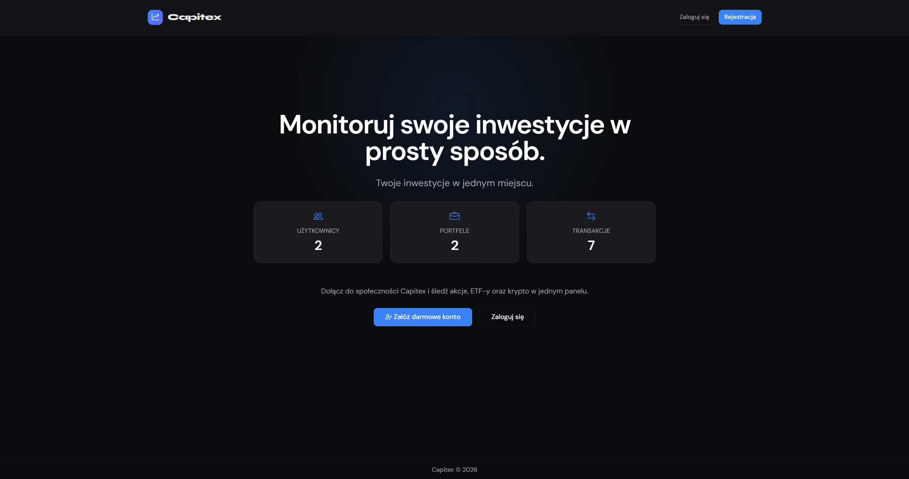

*Rys. 1 – Strona startowa: logo, liczniki (użytkownicy, portfele, transakcje) oraz przyciski **Rejestracja** i **Zaloguj się**.*

Wyświetlane liczby oznaczają:
- **Użytkownicy** – liczba kont w systemie,
- **Portfele** – łączna liczba portfeli wszystkich użytkowników,
- **Transakcje** – łączna liczba zapisanych transakcji kupna.

#### Logowanie

To samo okno logowania służy zarówno zwykłemu użytkownikowi, jak i administratorowi. Wejście możliwe ze strony tytułowej (przycisk **Zaloguj się** w nagłówku lub na dole strony).

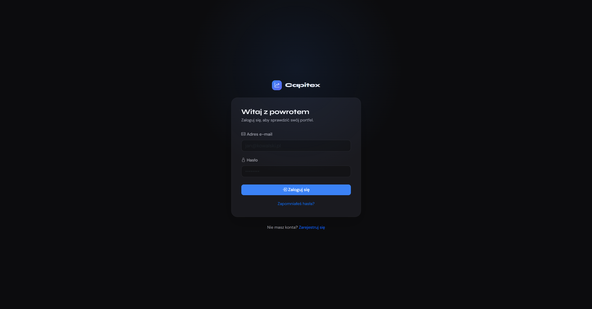

*Rys. 2 – Logowanie: adres e-mail, hasło oraz link **Zapomniałeś hasła?**.*

Wymagane pola:
- adres e-mail,
- hasło.

Link **Zapomniałeś hasła?** prowadzi do formularza resetu hasła. W wersji v1.0 wysyłka maila resetującego **nie jest jeszcze skonfigurowana** – ekran istnieje, ale funkcja nie działa end-to-end.

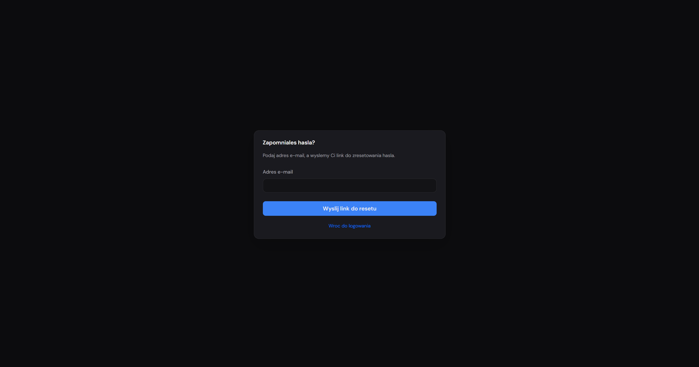

*Rys. 3 – Formularz „Zapomniałeś hasła?” z polem e-mail i linkiem powrotu do logowania.*

#### Rejestracja

Nowy użytkownik zakłada konto przez **Rejestracja** na stronie tytułowej. Po rejestracji otrzymuje rolę `user` i trafia na dashboard.

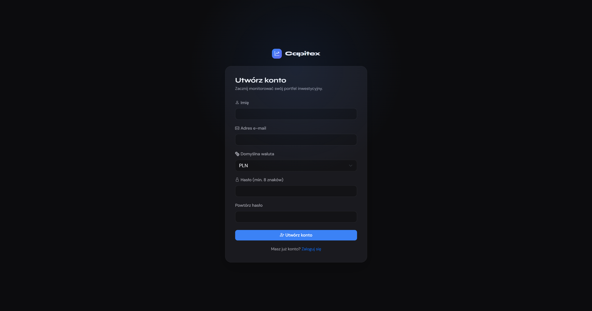

*Rys. 4 – Rejestracja: imię, e-mail, domyślna waluta (PLN / USD / EUR), hasło i potwierdzenie.*

W formularzu należy podać:
- imię,
- adres e-mail,
- domyślną walutę wyświetlania (**PLN**, **USD** lub **EUR**),
- hasło (min. 8 znaków) i jego powtórzenie.

Po kliknięciu **Utwórz konto** użytkownik jest przekierowywany na dashboard. Link **Zaloguj się** na dole formularza wraca do logowania.

### Panel administratora

Konto administratora tworzone jest przez seeder (środowisko deweloperskie):

| Pole | Wartość |
|------|---------|
| E-mail | `admin@capitex.pl` |
| Hasło | `admin` |

Po zalogowaniu tym kontem użytkownik ma rolę **admin** (`role_id = 1`) i widzi ten sam dashboard portfela co zwykły użytkownik, plus dodatkową pozycję menu **Panel admina**.

> Administrator **nie może** zmieniać haseł innych użytkowników – zarządza profilem (nazwa, e-mail, rola, waluta), ale nie hasłem.

#### Dashboard administratora (portfel)

Po logowaniu administrator trafia na dashboard inwestycyjny – tak jak użytkownik. Może tworzyć własne portfele i transakcje; obsługa opisana w sekcji **Panel użytkownika** poniżej.

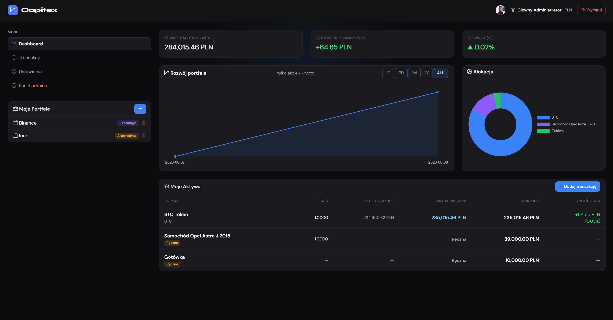

*Rys. 5 – Dashboard admina: statystyki portfela, wykresy, lista aktywów oraz w menu pozycja **Panel admina** (wyróżniona kolorem).*

#### Lista użytkowników (Panel admina)

Pozycja **Panel admina** w bocznym menu otwiera widok zarządzania kontami.

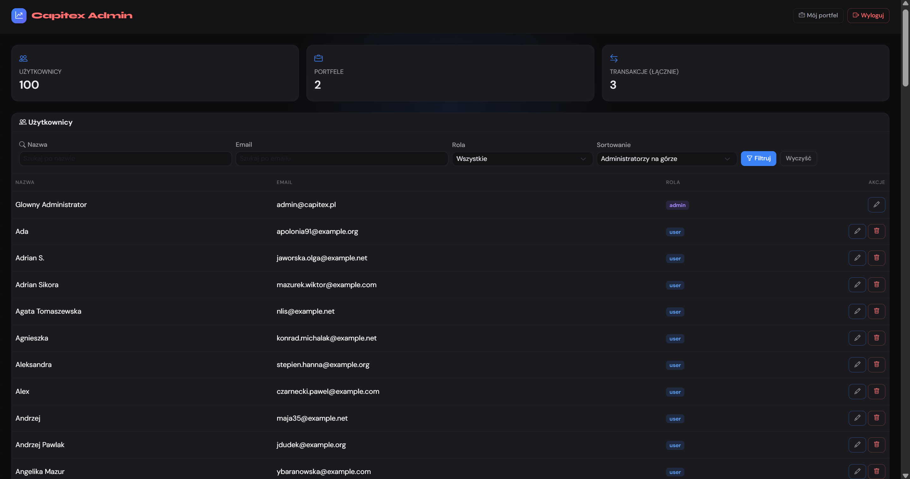

*Rys. 6 – Panel admina: statystyki (użytkownicy, portfele, transakcje), filtry oraz tabela kont z akcjami edycji i usuwania.*

W górnym pasku dostępne są:
- **Mój portfel** – powrót do dashboardu inwestycyjnego,
- **Wyloguj** – zakończenie sesji.

Trzy kafelki pokazują:
- liczbę użytkowników z rolą `user`,
- łączną liczbę portfeli w systemie,
- łączną liczbę transakcji.

Poniżej znajduje się tabela użytkowników oraz formularz filtrowania.

#### Filtrowanie i sortowanie

**Filtr po nazwie** – wyszukiwanie fragmentu imienia lub nazwiska.

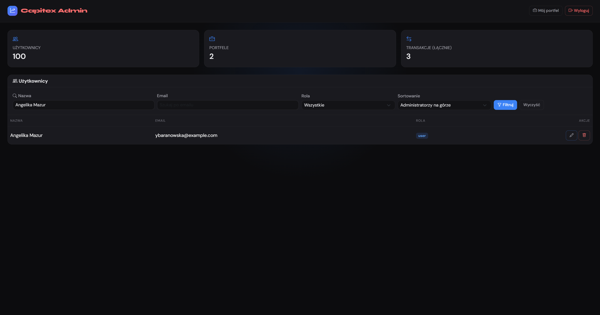

*Rys. 7 – Filtrowanie listy po polu **Nazwa** (np. „Angelika Mazur”).*

**Filtr po e-mailu** – wyszukiwanie po fragmencie adresu.

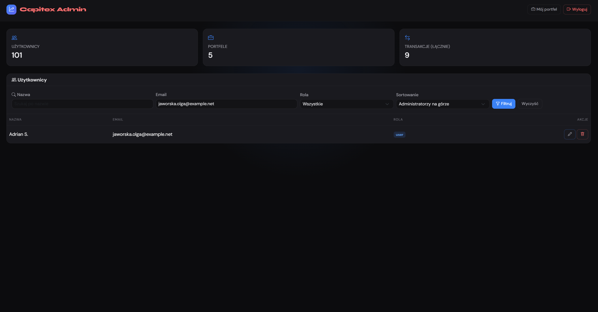

*Rys. 8 – Filtrowanie listy po polu **Email**.*

**Filtr po roli** – ograniczenie listy do administratorów lub zwykłych użytkowników.

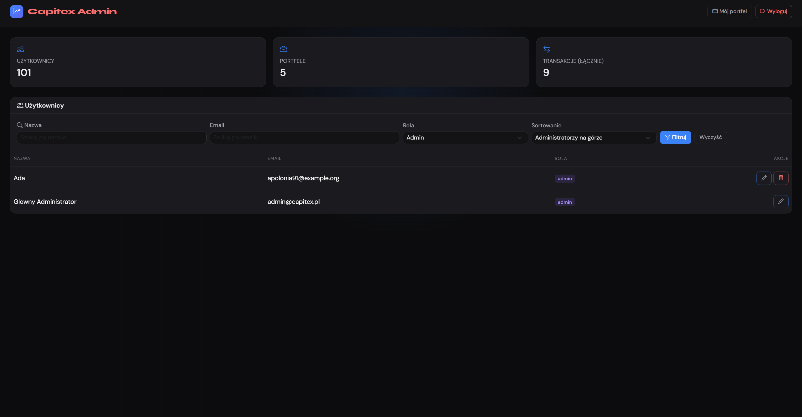

*Rys. 9 – Filtrowanie po roli (**user** lub **admin**).*

**Sortowanie** – kolejność wyświetlania w tabeli:

| Opcja | Efekt |
|-------|--------|
| Administratorzy na górze | Konta `admin` nad kontami `user` |
| Nazwa A–Z | Sortowanie alfabetyczne po imieniu |
| Email A–Z | Sortowanie alfabetyczne po adresie e-mail |

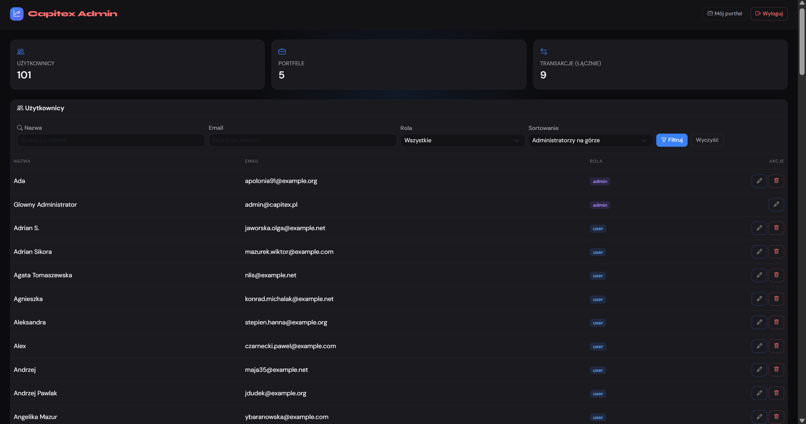

*Rys. 10a – Sortowanie: administratorzy na górze listy.*

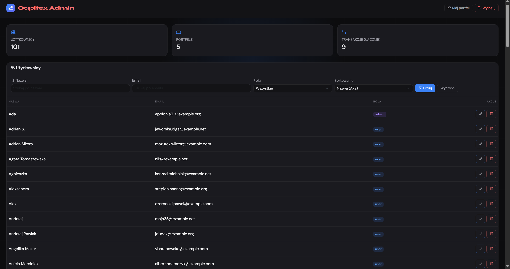

*Rys. 10b – Sortowanie alfabetyczne po nazwie.*

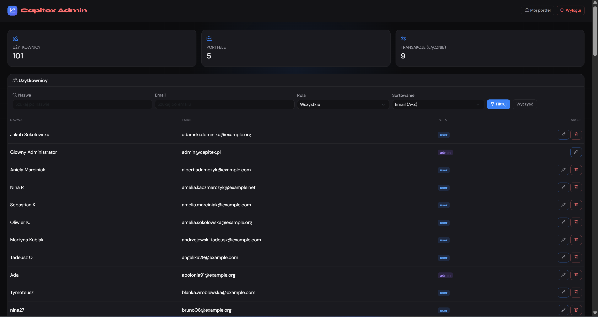

*Rys. 10c – Sortowanie alfabetyczne po adresie e-mail.*

Przycisk **Filtruj** stosuje kryteria; **Wyczyść** resetuje formularz.

#### Edycja użytkownika

Ikona ołówka w kolumnie **Akcje** otwiera formularz edycji wybranego konta.

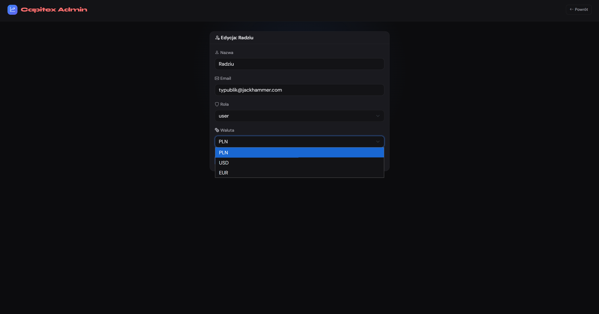

*Rys. 11 – Edycja: nazwa, e-mail, rola (user/admin), waluta domyślna.*

Administrator może zmienić:
- nazwę,
- adres e-mail,
- rolę (`user` / `admin`) – **z wyjątkiem własnego konta** (nie może odebrać sobie roli admina),
- walutę wyświetlania (PLN / USD / EUR).

#### Usuwanie użytkownika

Ikona kosza usuwa konto wraz z powiązanymi portfelami i transakcjami (kasowanie kaskadowe).

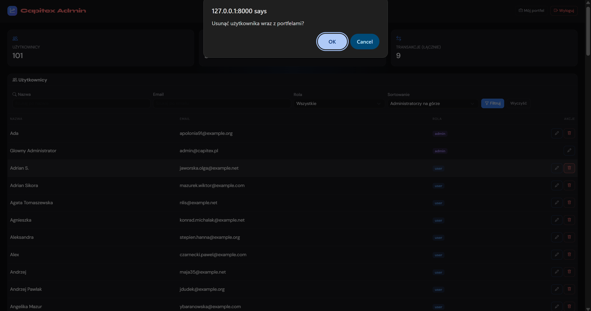

*Rys. 12 – Potwierdzenie usunięcia użytkownika z listy.*

Ograniczenia:
- administrator **nie może usunąć samego siebie**,
- **nie można usunąć ostatniego** konta z rolą `admin`.

#### Podsumowanie – funkcjonalności administratora

Administrator w aplikacji Capitex może:

- zalogować się tym samym formularzem co zwykły użytkownik,
- korzystać z **własnego dashboardu** (portfele, transakcje, wykresy) – tak jak użytkownik,
- wejść w **Panel admina** z bocznego menu,
- przeglądać **statystyki systemu** (liczba użytkowników, portfeli, transakcji),
- **filtrować listę kont** po nazwie, e-mailu i roli,
- **sortować listę** (admini na górze, nazwa A–Z, e-mail A–Z),
- **edytować dane użytkownika** (nazwa, e-mail, rola, waluta),
- **usuwać konta użytkowników** (z portfelami i transakcjami), z wyjątkiem siebie i ostatniego admina,
- wrócić do **Mój portfel** lub **wylogować się**.

Administrator **nie może**:
- ustawiać ani resetować haseł innych użytkowników,
- edytować transakcji ani portfeli innych użytkowników z poziomu panelu admina (tylko zarządza kontami).

### Panel użytkownika

Zwykły użytkownik (`role_id = 2`) po rejestracji lub logowaniu zarządza własnymi portfelami, transakcjami i ustawieniami profilu. Nie widzi **Panelu admina** w menu.

#### Dashboard główny

Po zalogowaniu użytkownik trafia na dashboard inwestycyjny. Ekran składa się z:

- **górnego paska** – nazwa użytkownika, avatar, przycisk **Wyloguj**,
- **menu bocznego** – Dashboard, Transakcje, Ustawienia oraz lista **Moje Portfele**,
- **obszaru głównego** – kafelki (wartość całkowita, niezrealizowany zysk, zwrot %), wykres liniowy, wykres kołowy (alokacja) oraz tabela **Moje Aktywa** (suma ze wszystkich portfeli).

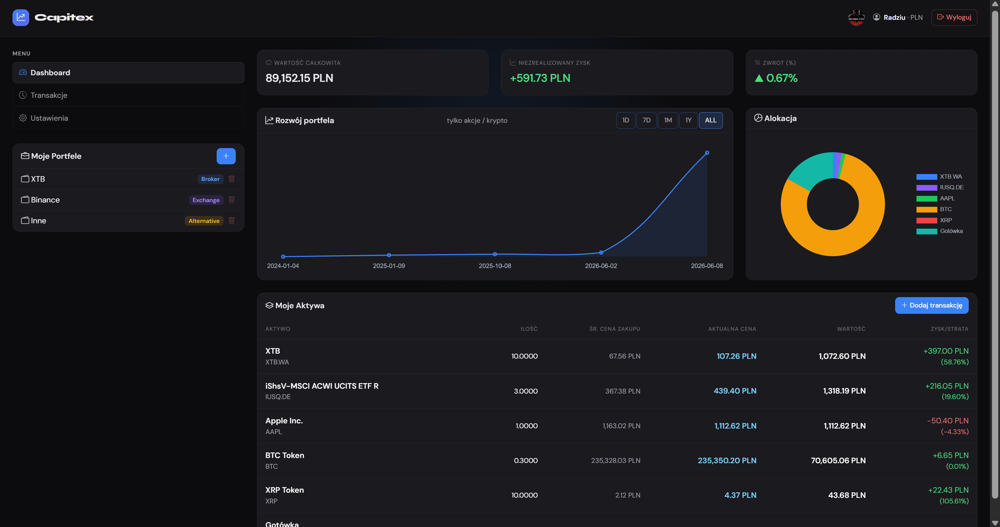

*Rys. 13 – Dashboard: statystyki portfela, wykresy, tabela aktywów i lista portfeli w menu bocznym.*

#### Historia transakcji

Pozycja **Transakcje** w menu otwiera listę wszystkich transakcji użytkownika. Powrót do dashboardu: **Dashboard** w menu bocznym.

Tabela pokazuje m.in. datę, portfel, aktywo, ilość, cenę jednostkową i wartość transakcji. Filtry stosuje się przyciskiem **Filtruj** (formularz GET – Enter w polu filtra również wysyła formularz).


*Rys. 14 – Widok transakcji z formularzem filtrowania nad tabelą.*

##### Filtrowanie i sortowanie transakcji

| Filtr / sortowanie | Opis |
|--------------------|------|
| **Nazwa aktywa** | Fragment nazwy instrumentu (np. „NVIDIA”) |
| **Ticker** | Symbol giełdowy (np. „NVDA”, „BTC”) |
| **Portfel** | Nazwa portfela (np. „XTB”) |
| **Sortowanie** | Data ↓/↑, ticker A–Z, nazwa aktywa A–Z, portfel A–Z |

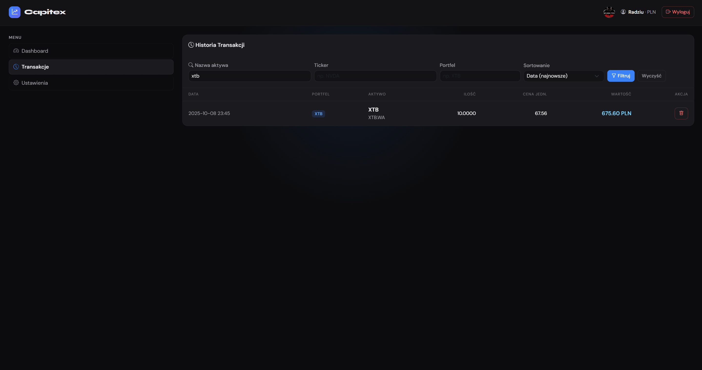

*Rys. 15 – Filtrowanie transakcji po nazwie aktywa.*

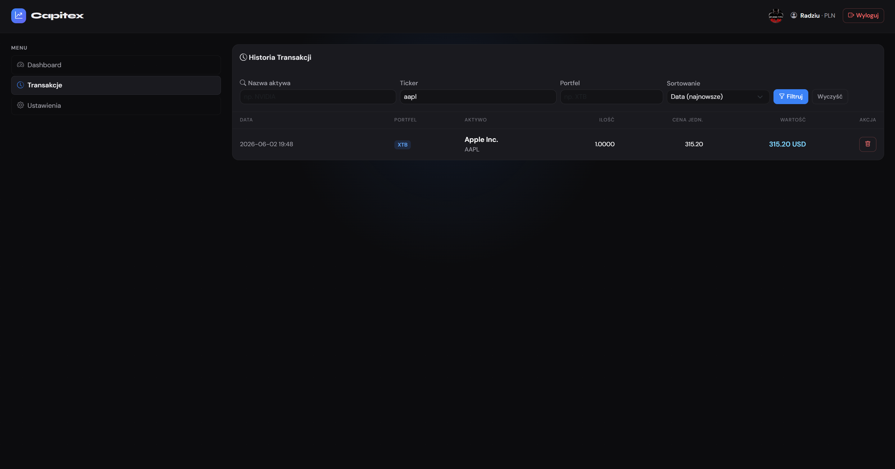

*Rys. 16 – Filtrowanie po symbolu tickera (akcje, ETF, krypto).*

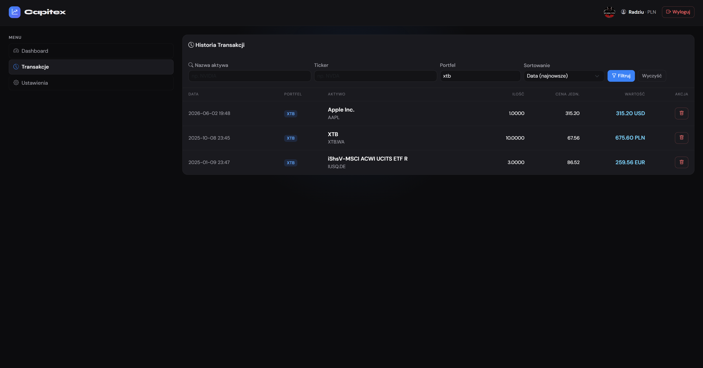

*Rys. 17 – Filtrowanie transakcji przypisanych do wybranego portfela.*

Opcje sortowania (pole rozwijane **Sortowanie**):

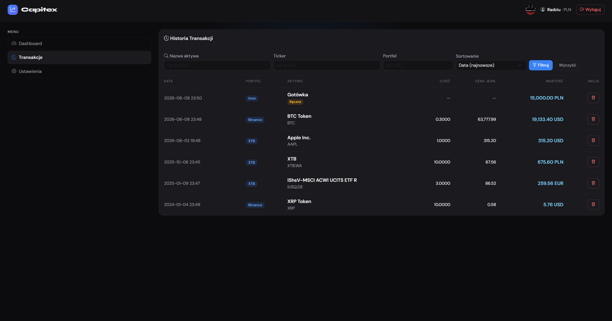

*Rys. 18a – Sortowanie: data (najnowsze).*

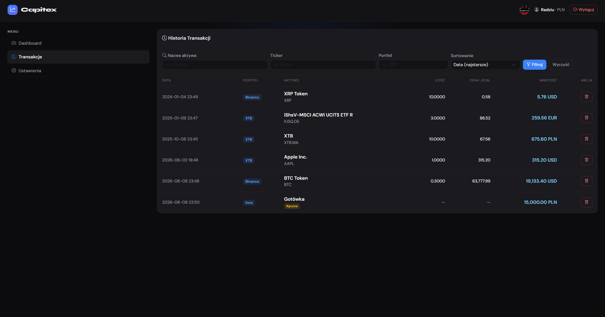

*Rys. 18b – Sortowanie: data (najstarsze).*

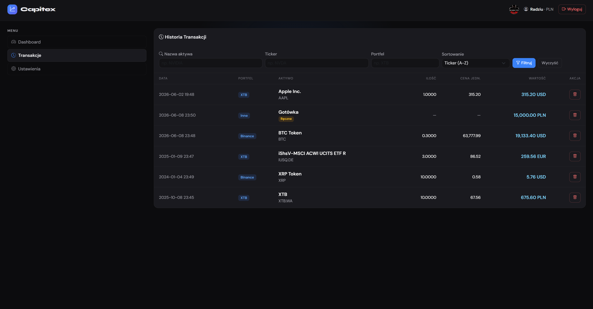

*Rys. 18c – Sortowanie alfabetyczne po tickerze.*

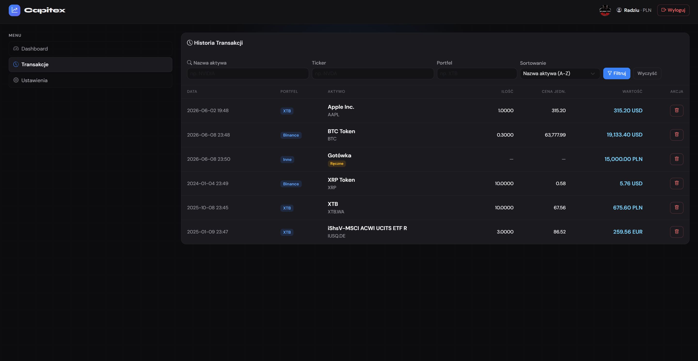

*Rys. 18d – Sortowanie alfabetyczne po nazwie aktywa.*

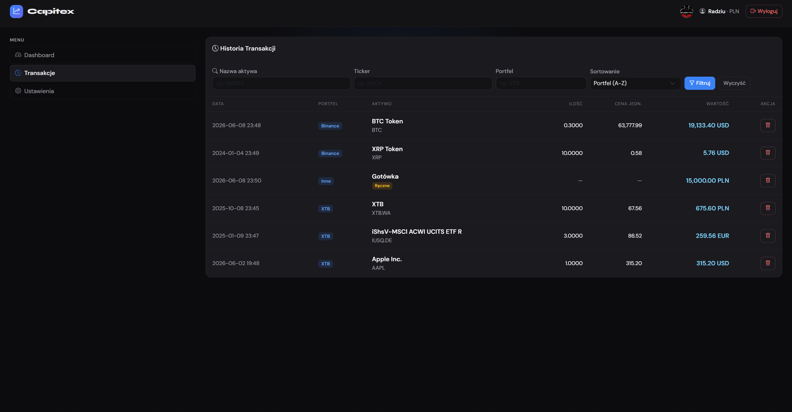

*Rys. 18e – Sortowanie alfabetyczne po nazwie portfela.*

##### Skrót z dashboardu

Kliknięcie wiersza aktywa w tabeli **Moje Aktywa** na dashboardzie przenosi do transakcji z filtrem po tickerze tego instrumentu.


*Rys. 19a – Kliknięcie w aktywo na dashboardzie (wiersz w **Moje Aktywa**).*


*Rys. 19b – Lista transakcji przefiltrowana do wybranego tickera.*

##### Usuwanie transakcji

Czerwona ikona kosza w kolumnie akcji usuwa transakcję po potwierdzeniu w oknie dialogowym.

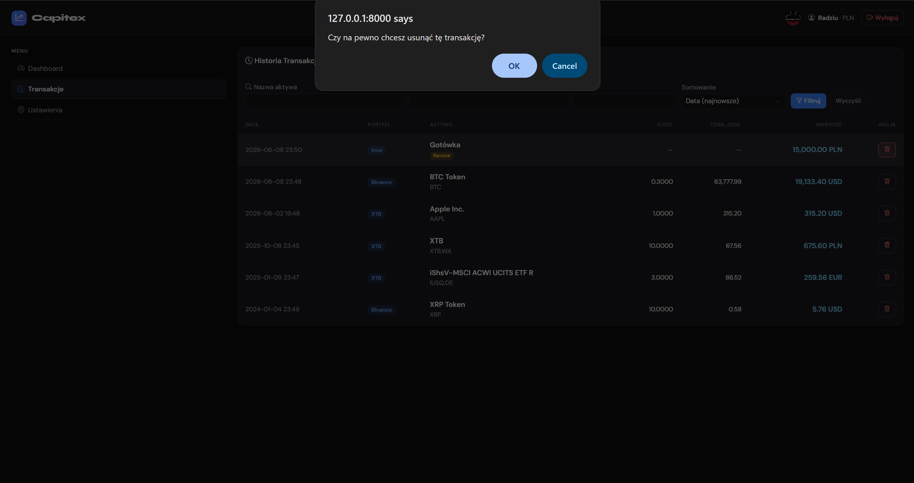

*Rys. 20 – Usunięcie pojedynczej transakcji z historii.*

#### Ustawienia profilu

Pozycja **Ustawienia** w menu prowadzi do edycji profilu i hasła.

W sekcji **Profil i preferencje** użytkownik może:
- wgrać **avatar** (JPG, PNG, WEBP, max 2 MB),
- zmienić **nazwę** i **adres e-mail**,
- wybrać **walutę wyświetlania** (PLN / USD / EUR) – wartości na dashboardzie przeliczane są przez kursy NBP,
- zapisać zmiany przyciskiem **Zapisz ustawienia**.

W sekcji **Zmiana hasła** (osobny formularz):
- obecne hasło,
- nowe hasło i potwierdzenie,
- przycisk **Zmień hasło**.

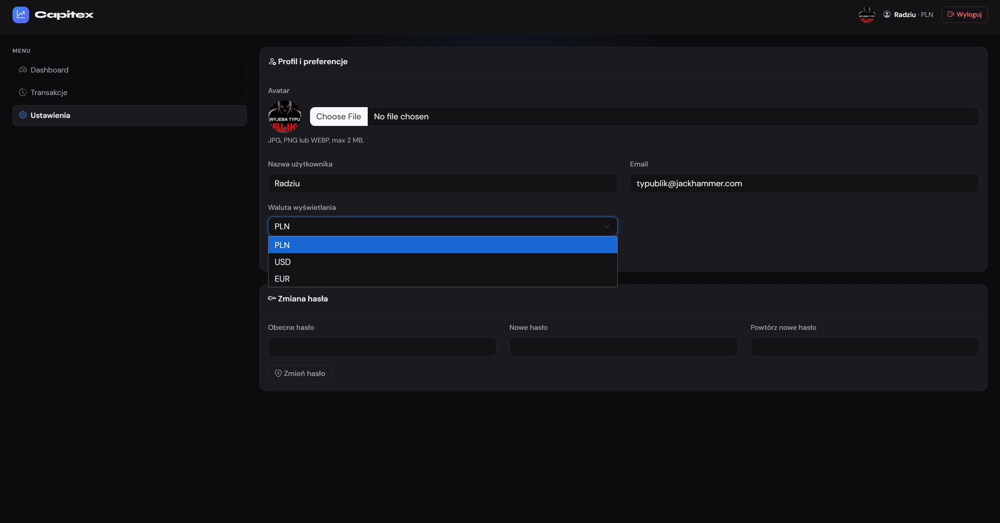

*Rys. 21 – Fragment ustawień: waluta wyświetlania i zapis profilu.*

#### Dodawanie transakcji (broker / giełda)

Przycisk **+ Dodaj transakcję** na dashboardzie (głównym lub portfela) otwiera modal.

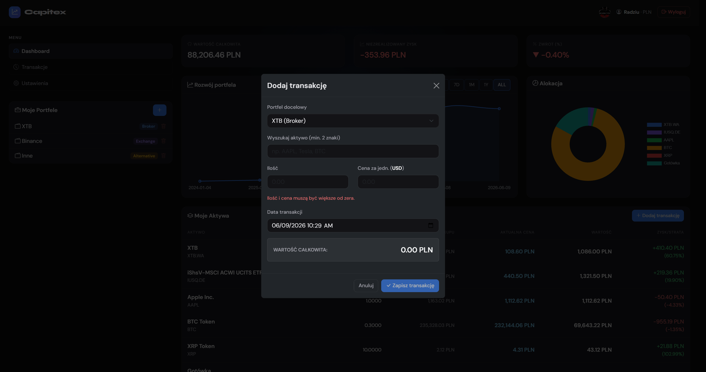

*Rys. 22 – Formularz transakcji dla portfela typu Broker lub Exchange.*

Pola formularza (akcje, ETF, krypto):
- **Portfel docelowy** – wybór z listy portfeli użytkownika,
- **Wyszukaj aktywo** – autocomplete z API (Yahoo Finance dla brokerów, Binance dla krypto),
- **Ilość** i **cena za jednostkę** (cena z API na wybraną datę lub wpisana ręcznie),
- **Data transakcji**,
- podgląd **wartości całkowitej** i kursu do PLN (NBP).

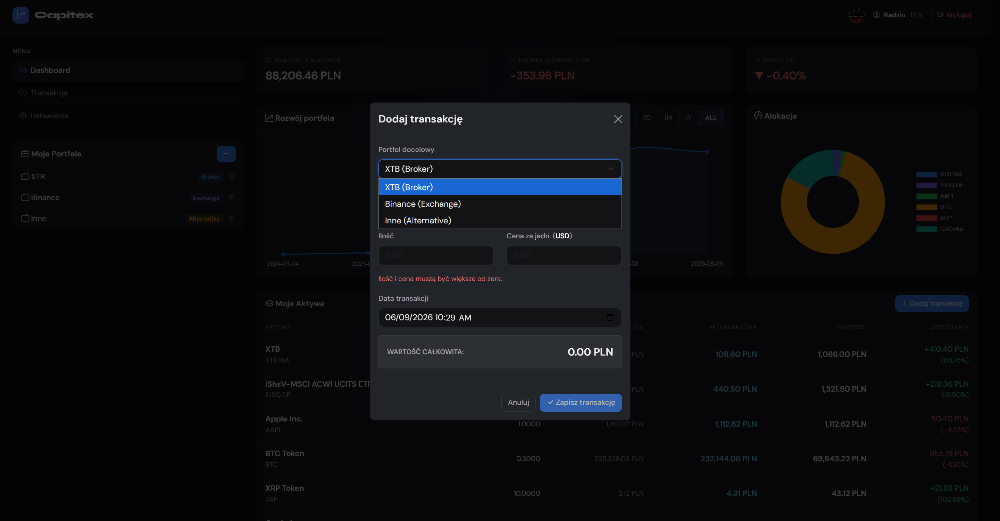

*Rys. 23 – Pole rozwijane **Portfel docelowy** w modalu transakcji.*

#### Dodawanie transakcji (portfel alternatywny)

Dla portfela kategorii **Alternatywne** modal przełącza się na formularz ręczny (bez wyszukiwarki giełdowej):

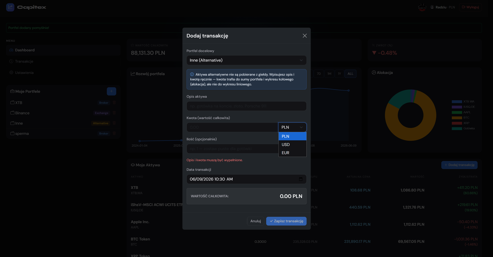

*Rys. 24 – Formularz dla gotówki, auta itd.: opis, kwota, opcjonalna ilość, waluta (PLN/USD/EUR), data.*

- **Opis aktywa** – np. „gotówka na koncie”, „Samochód Opel Astra”,
- **Kwota** – wartość całkowita transakcji,
- **Ilość** (opcjonalnie) – puste dla gotówki; np. `1` dla pojedynczego przedmiotu,
- **Waluta** – PLN, USD lub EUR,
- **Data transakcji**.

Aktywa alternatywne wliczają się do **wartości portfela** i **wykresu kołowego** (alokacja), ale **nie** do wykresu liniowego (brak notowań z API).

#### Zarządzanie portfelami

##### Dodawanie portfela

Przycisk **+** przy nagłówku **Moje Portfele** otwiera modal tworzenia portfela.

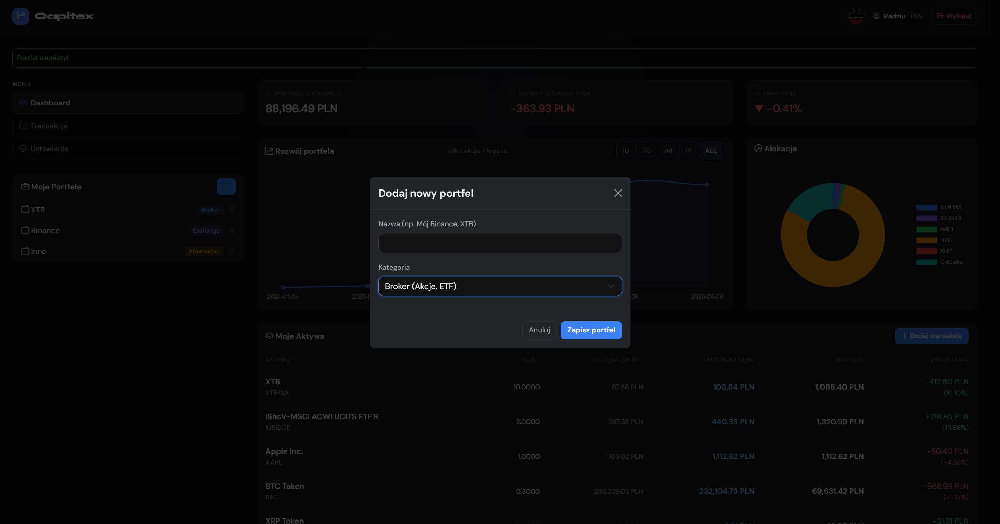

*Rys. 25a – Przycisk **+** przy sekcji portfeli.*

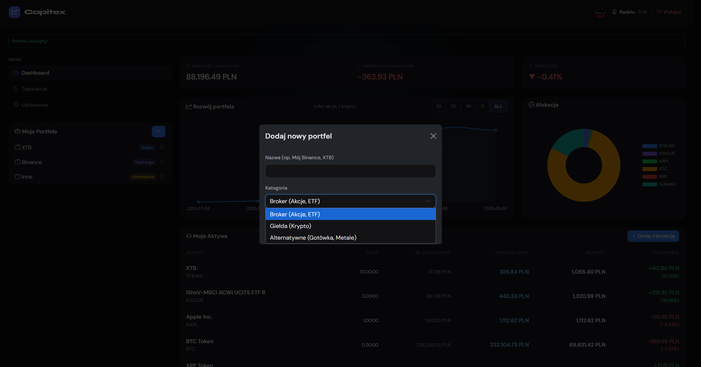

*Rys. 25b – Nazwa portfela i kategoria: **Broker** (akcje, ETF), **Giełda** (krypto), **Alternatywne** (gotówka, dobra ręczne).*

Zatwierdzenie: **Zapisz portfel**.

##### Usuwanie portfela

Ikona kosza obok nazwy portfela usuwa portfel wraz z jego transakcjami (po potwierdzeniu).

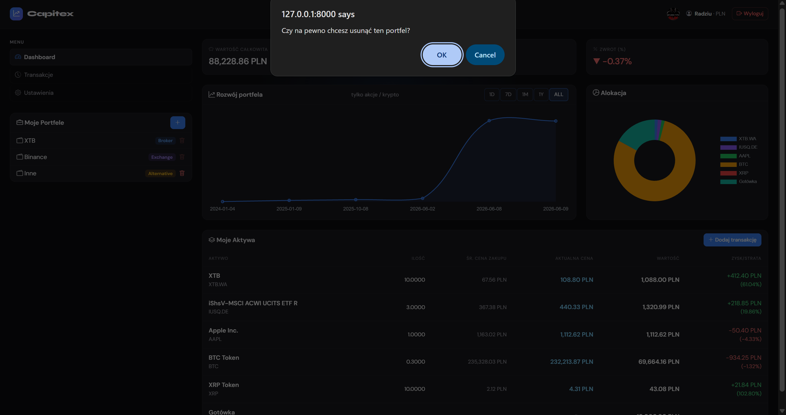

*Rys. 26 – Potwierdzenie usunięcia portfela z listy bocznej.*

##### Dashboard pojedynczego portfela

Kliknięcie **nazwy portfela** w menu bocznym otwiera widok z danymi tylko tego portfela (te same wykresy i tabela, bez pozycji z innych portfeli).

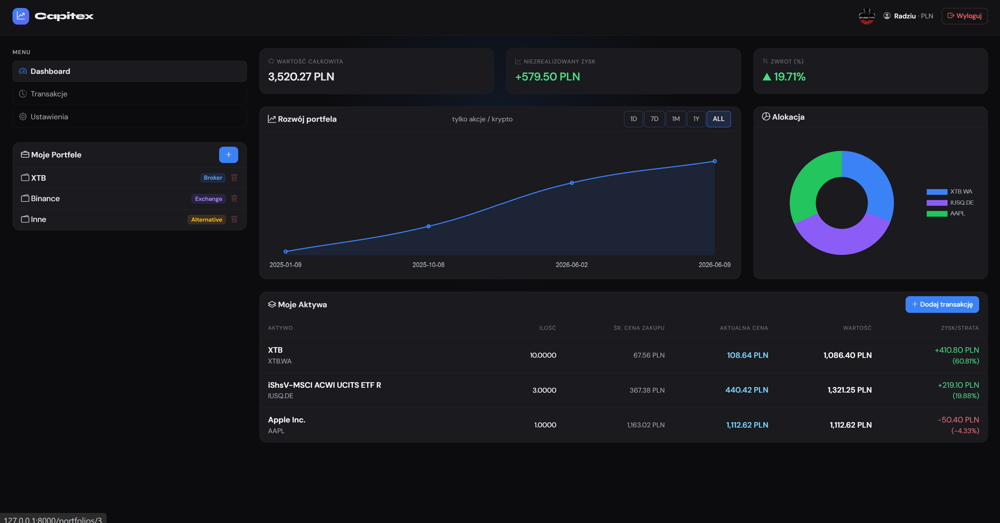

*Rys. 27 – Pod-dashboard jednego portfela (np. XTB).*

#### Wykresy

**Wykres kołowy (Alokacja)** – udział poszczególnych aktywów w portfelu (w tym pozycje ręczne / gotówka).

**Wykres liniowy (Rozwój portfela)** – zmiana wartości w czasie na podstawie transakcji rynkowych (akcje, ETF, krypto). Zakresy: **1D**, **7D**, **1M**, **1Y**, **ALL**. Aktywa alternatywne nie są uwzględniane na tym wykresie.

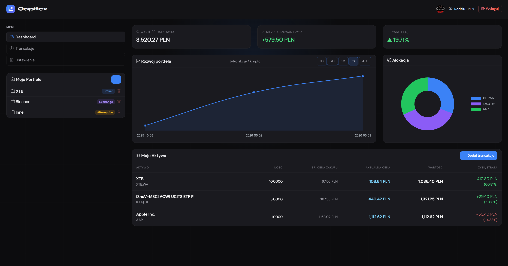

*Rys. 28 – Wykres liniowy z wybranym filtrem czasu **1Y**.*

#### Wylogowanie

Przycisk **Wyloguj** w prawym górnym rogu kończy sesję i przekierowuje na stronę tytułową.

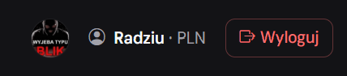

*Rys. 29a – **Wyloguj** obok nazwy użytkownika i avatara.*

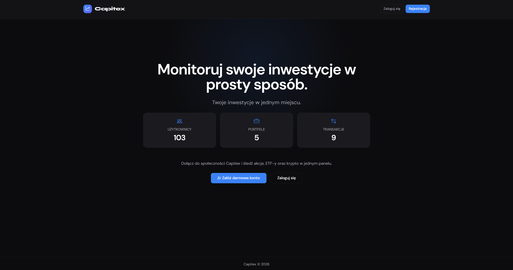

*Rys. 29b – Powrót na stronę startową po wylogowaniu.*

#### Podsumowanie – funkcjonalności użytkownika

Użytkownik w aplikacji Capitex może:

- zarejestrować konto i zalogować się,
- przeglądać **dashboard** ze statystykami portfela (wartość, zysk/strata, zwrot %),
- tworzyć i usuwać **portfele** (Broker, Giełda, Alternatywne),
- otwierać **widok jednego portfela** (kliknięcie nazwy w menu),
- dodawać **transakcje kupna** – z API (akcje, ETF, krypto) lub ręcznie (aktywa alternatywne),
- przeglądać **historię transakcji** z filtrowaniem (nazwa, ticker, portfel) i sortowaniem,
- przejść z dashboardu do transakcji danego aktywa (klik w wiersz tabeli),
- **usuwać** transakcje,
- zmieniać **ustawienia profilu** (avatar, nazwa, e-mail, waluta wyświetlania),
- zmieniać **własne hasło**,
- korzystać z **wykresów** (alokacja + rozwój portfela dla aktywów rynkowych),
- **wylogować się**.

Użytkownik **nie może** (w v1.0):

- edytować istniejących transakcji ani portfeli (tylko dodawanie i usuwanie),
- rejestrować transakcji sprzedaży (*sell*),
- zarządzać kontami innych użytkowników,
- wejść w panel administratora.

## Plany rozbudowy

### Czego zabrakło w pierwszej wersji (v1.0)

- **Transakcje sprzedaży** – system obsługuje wyłącznie transakcje typu *buy* (kupno); brak sprzedaży częściowej ani zamknięcia pozycji.
- **Edycja danych** – brak aktualizacji istniejących transakcji i portfeli (dostępne są: dodawanie i usuwanie).
- **Publiczne wdrożenie** – aplikacja działa lokalnie; nie ma jeszcze stałego adresu w internecie dla użytkownika końcowego.
- **Import / eksport** – brak importu historii z brokera (CSV, API XTB itd.) oraz eksportu raportów (PDF, Excel).
- **Powiadomienia** – brak alertów cenowych, e-maili ani powiadomień push.
- **Zaawansowane raporty** – brak raportów podatkowych, zestawień rocznych czy porównań z indeksami.
- **Wielowalutowość w UI** – kursy NBP są używane w obliczeniach, ale interfejs nie oferuje pełnego przełączania widoku na dowolną walutę.
- **Testy automatyczne** – brak pokrycia testami jednostkowymi i integracyjnymi kluczowych serwisów (np. `PortfolioService`, `ApiService`).

### Funkcjonalności na v2.0

- **Pełny cykl transakcji** – kupno i sprzedaż, automatyczne przeliczanie średniej ceny zakupu i realizowanego zysku/straty.
- **Import danych** – wgrywanie historii transakcji z pliku CSV lub integracja z wybranym brokerem.
- **Alerty i powiadomienia** – progi cenowe oraz e-maile (np. Laravel Notifications + kolejka zadań).
- **Raporty i eksport** – generowanie raportów PDF/Excel, wykresy historyczne wartości portfela w czasie.
- **Wdrożenie produkcyjne** – hosting z HTTPS, backup bazy, monitoring dostępności.
- **Uwierzytelnianie rozszerzone** – logowanie OAuth (Google), opcjonalnie 2FA.
- **API REST dla użytkownika** – odczyt portfela przez zewnętrzne narzędzia (z tokenami API).
- **Więcej klas aktywów** – obligacje, fundusze, nieruchomości (REIT) z dedykowanymi źródłami cen.

### Potencjał optymalizacji

- **Cache cen i kursów walut** – zapisywanie odpowiedzi z Binance, Yahoo Finance i NBP w Redis lub cache Laravela (np. 1–5 min), aby ograniczyć liczbę zapytań i przyspieszyć dashboard.
- **Kolejki zadań** – odświeżanie cen w tle (`php artisan queue:work`) zamiast synchronicznego pobierania przy każdym wejściu na stronę.
- **Baza danych** – migracja z SQLite na **PostgreSQL** lub **MySQL** przy większej liczbie użytkowników i potrzebie współbieżnych zapisów.
- **Indeksy i zapytania** – optymalizacja zapytań do transakcji (filtry, sortowanie) oraz indeksy na kolumnach `user_id`, `ticker`, `portfolio_id`.
- **Frontend** – lazy loading wykresów Chart.js, debounce w autocomplete aktywów, opcjonalnie PWA (działanie offline z cache statycznym).
- **CDN i asset pipeline** – serwowanie zbudowanych plików CSS/JS z CDN po wdrożeniu produkcyjnym.
- **Rate limiting API zewnętrznych** – centralne zarządzanie limitami zapytań do Yahoo/Binance, aby uniknąć blokad przy wielu użytkownikach jednocześnie.